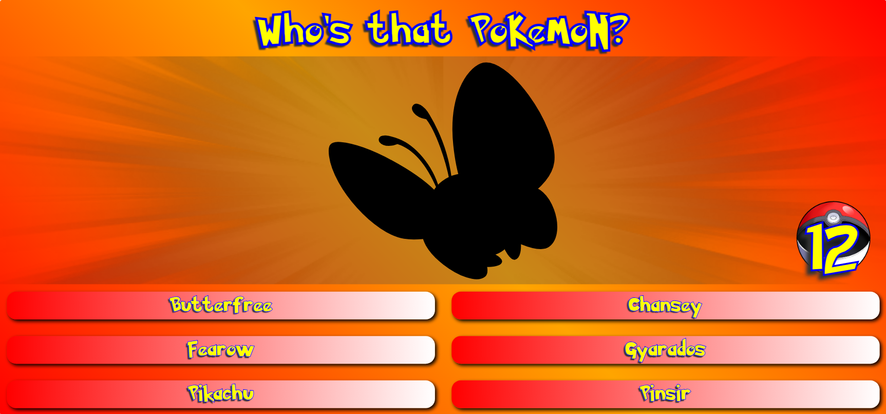
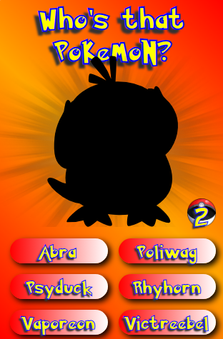
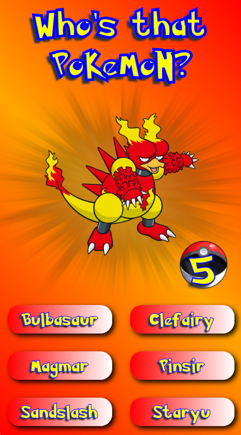
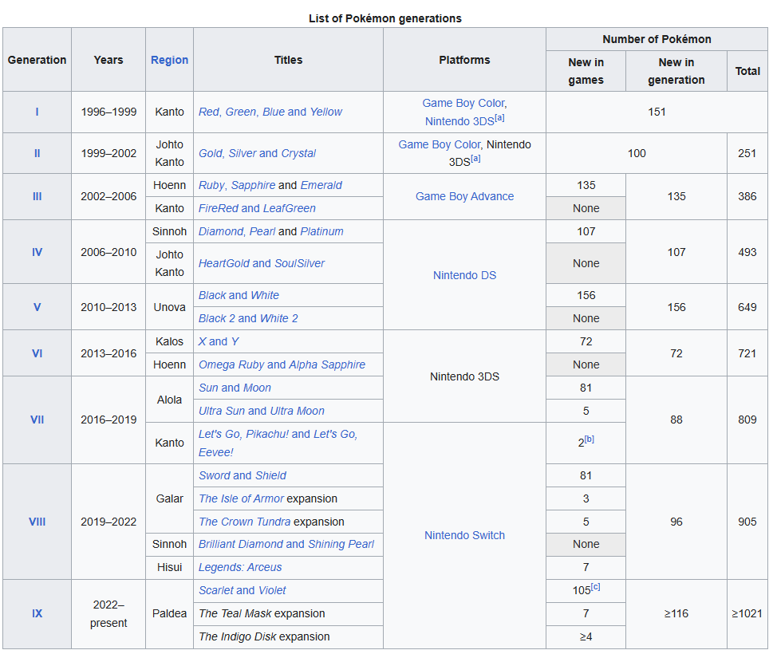

# **Projeto Quem é esse Pokemon?**  
Game nostálgico do intervalo do anime.
______________________

# Como inicializar:
Só rodar o *npm start* e tentar fazer 20 pontos.

Treinei um pouco de responsividade em algumas resoluções: Desktop, mobile(pequeno) e Iphones(6/7/8 plus).

Desktop:

Mobile:

Iphone:

# Detalhes

É possível jogar com pokemóns de outras gerações. No App.tsx, linha 14 existe uma variável chamada *generation*. Para isso, altere o valor para o total de pokemóns de cada geração de acordo com a tabela abaixo.

É importante lembrar que todas as imagens e nomes foram extraídas do PokeAPI, podendo apresentar alguma ausência ou incompatibilidade na geração de imagens ou texto que represente os pokemóns.

# Sobre:

Me inspirei em criar esse projeto enquanto procurava alguma API para saber como funcionava, já que estava estudando sobre.
Depois de me debater bastante, eu encontrei essa e mexi um pouco pra entender o que era o sprite, o que era o nome, id e outros dados de cada pokemon. Quando vi a sprite sozinha no meu html, tentei pintar ela de preto pra testar.

Sempre gostei de criar. Um gamezinho as vezes dá um gostinho, né?

Evoluções pessoais:
- Aprendi a usar API, conheci ferramentas como Postman.
- Comecei a treinar meu Typescript.
- É o primeiro projeto que faço sem uma aula ensinando.
- Treinei muito meu CSS. Optei por não arriscar o SASS pra treinar mais um pouco a base.
- Ganhei um pouco de experiência com bugs e UI/UX.
- Eu sei que é genérico, mas conseguir fazer um joguinho é muito recompensador.

Obrigado por ler até aqui!

Meus contatos: 
- 11 98545-2742 (Whatsapp)
- Yokis (Discord)